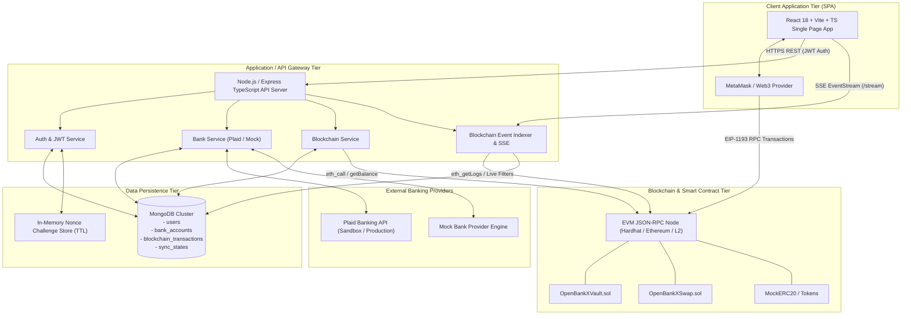
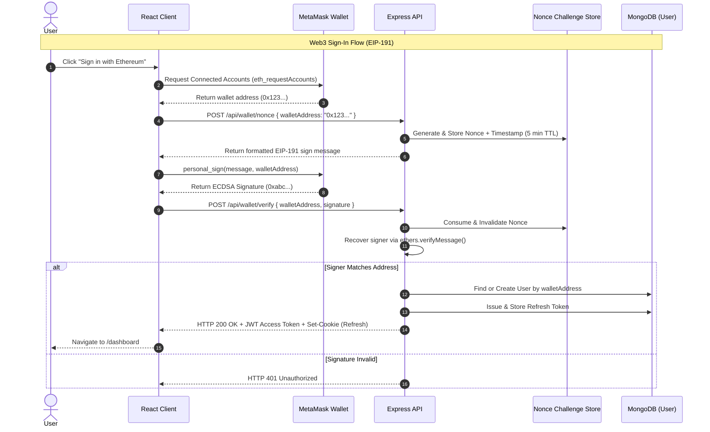
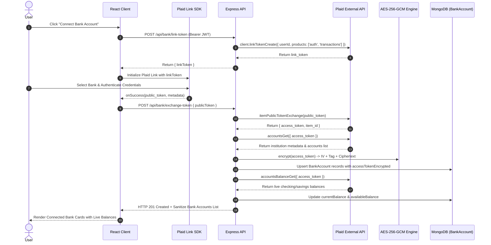
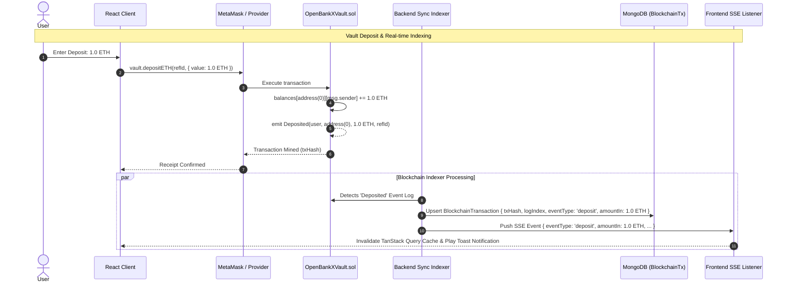
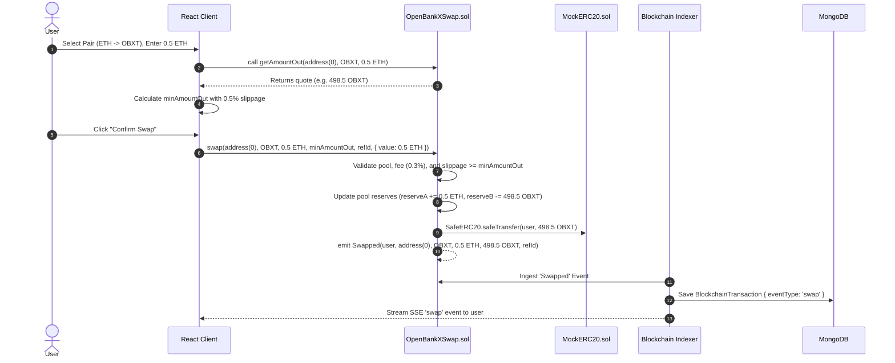
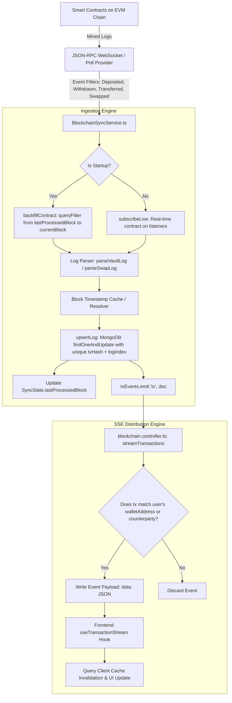

# OpenBankX — High-Level Design Document (HLD)

---

## 1. System Overview & Architectural Principles

**OpenBankX** is designed as a modular, decoupled, event-driven hybrid fintech architecture. The platform seamlessly bridges the **Fiat Rail** (traditional banking infrastructure via Plaid and Open Banking protocols) and the **Crypto Rail** (decentralized smart contracts on EVM-compatible blockchains).

```
                      +----------------------------------------+
                      |         OpenBankX Architecture         |
                      +----------------------------------------+
                                          |
         +--------------------------------+--------------------------------+
         |                                                                 |
         v                                                                 v
+------------------+                                             +--------------------+
|    FIAT RAIL     |                                             |    CRYPTO RAIL     |
| (Traditional)    |                                             |   (Decentralized)  |
+------------------+                                             +--------------------+
| • Plaid OpenBank |                                             | • EVM Contracts    |
| • Mock Sandbox   |                                             | • OpenBankXVault   |
| • AES-256-GCM    |                                             | • OpenBankXSwap    |
| • Balance Sync   |                                             | • Real-Time SSE    |
+------------------+                                             +--------------------+
```

### 1.1 Core Architectural Principles
1. **Separation of Concerns**: Strict boundary between off-chain accounting (read caches, user identity, aggregated views) and on-chain authority (funds custody, AMM liquidity, state transitions).
2. **On-Chain Financial Truth**: All crypto fund movements, balances, and liquidity math exist exclusively on-chain (`OpenBankXVault` and `OpenBankXSwap`). The backend indexes smart contract logs into MongoDB solely for fast queries and real-time frontend streaming.
3. **Zero-Knowledge Credential Handling**: Third-party bank access tokens are never exposed to the client or stored in plaintext; they are encrypted at rest with AES-256-GCM.
4. **Event-Driven Reactivity**: Real-time contract events are ingested via WebSocket/JSON-RPC listeners and pushed to clients via Server-Sent Events (SSE) without client polling.
5. **Idempotency & Reorg Resilience**: Every indexed blockchain event is uniquely identified by `(txHash, logIndex)` with deterministic state updates.

---

## 2. High-Level System Architecture

### 2.1 System Context & Container Diagram



---

## 3. Core Subsystem Breakdown

### 3.1 Client Tier (Frontend Single Page Application)
- **Framework**: React 18, Vite, TypeScript, TailwindCSS, Radix UI primitives.
- **State Management**:
  - **Zustand**: Client authentication state, linked wallet address, active tokens.
  - **TanStack React Query**: Server state caching, optimistic updates, automatic invalidation for bank accounts, balances, transaction history, and quotes.
- **Web3 Interaction**: `ethers.js` (v6) BrowserProvider for communicating with MetaMask, requesting signatures, approving tokens, and invoking smart contract write methods (`depositETH`, `depositToken`, `withdrawETH`, `withdrawToken`, `transfer`, `swap`).
- **Real-Time Integration**: Native `EventSource` connection for receiving live transaction events over SSE.

### 3.2 Backend API Tier (Node.js & Express)
- **Runtime & Language**: Node.js, Express.js, TypeScript with strict type checking.
- **Security Middleware**: CORS origin verification, Helmet HTTP headers, IP-based rate limiting (`express-rate-limit`), cookie parser for HTTP-only refresh tokens, global async error handler.
- **Authentication Subsystem**:
  - Email/Password login: bcrypt password hashing ($\ge 12$ salt rounds), dual JWT model (15-minute access token + 7-day refresh token in HTTP-only cookie with reuse revocation).
  - Web3 Nonce Challenge: In-memory store with automatic TTL cleanup; cryptographic message verification with `ethers.verifyMessage`.
- **Bank Provider Interface Subsystem**:
  - Plaid Provider: Integrates with official Plaid SDK for link token creation, public token exchange, and balance fetching.
  - Mock Provider: In-memory deterministic simulator for offline local development and rapid testing.
  - Cryptography Engine: AES-256-GCM cipher for protecting `accessTokenEncrypted` at rest.

### 3.3 Blockchain Indexer & Real-Time Sync Subsystem
- **Historical Event Backfill**: Scans past blocks starting from `SyncState.lastProcessedBlock` up to current chain head for `Deposited`, `Withdrawn`, `Transferred`, and `Swapped` events.
- **Live Event Subscription**: Subscribes to smart contract event filters on the JSON-RPC provider. On new mined block logs:
  1. Parses raw log arguments into structured domain events.
  2. Fetches block timestamps (with caching).
  3. Upserts transaction into MongoDB with unique key `(txHash, logIndex)`.
  4. Emits internal event via `txEvents` (`EventEmitter`).
  5. Updates `SyncState.lastProcessedBlock`.
- **Server-Sent Events (SSE)**: Streams filtered transaction payloads directly to clients matching either `walletAddress` or `counterpartyAddress` with a 25-second heartbeat ping.

### 3.4 Smart Contract Tier (Solidity 0.8.24)
- **`OpenBankXVault.sol`**:
  - Central ledger for native ETH (`address(0)`) and approved ERC-20 tokens.
  - Non-custodial deposit & withdrawal functions using OpenZeppelin `ReentrancyGuard` and `SafeERC20`.
  - Internal P2P transfer method (`transfer`) allowing instant off-chain/on-chain settlement between registered addresses without external token transfers.
  - Emergency `Pausable` control by contract owner.
- **`OpenBankXSwap.sol`**:
  - Automated Market Maker based on constant-product invariant $x \cdot y = k$.
  - 0.3% fixed swap fee retained in liquidity pool.
  - Permanent lock of `MINIMUM_LIQUIDITY` (1000 wei) on initial deposit to defend against first-depositor inflation attacks.
  - Slippage control via `minAmountOut` parameter.
  - Permissioned pool creation by contract owner.
- **`MockERC20.sol`**:
  - 18-decimal test token (`OBXT`) with public faucet function for local development.

---

## 4. End-to-End Sequence & Data Flow Diagrams

### 4.1 Dual-Rail Authentication & Web3 Nonce Challenge Flow



---

### 4.2 Fiat Rail Account Linking & Balance Sync Flow



---

### 4.3 Web3 Vault Operations (Deposit, Internal Transfer, Withdraw)



---

### 4.4 Automated Market Maker (AMM) Swap Flow



---

### 4.5 Real-Time Blockchain Sync & SSE Ingestion Pipeline



---

## 5. Technology Stack & Component Justification

| Layer | Selected Technology | Version | Rationale & Trade-Offs |
| :--- | :--- | :--- | :--- |
| **Frontend Framework** | React + Vite | React 18.3, Vite 5.x | Ultra-fast HMR build times, rich TypeScript support, native React 18 concurrency and hooks. |
| **Styling & Design System** | TailwindCSS + Radix UI | Tailwind 3.4, Radix Primitives | Headless, accessible primitives with zero runtime CSS overhead, dark/light banking theme. |
| **State & Data Fetching** | TanStack React Query + Zustand | React Query 5.x, Zustand 4.x | React Query handles automatic caching, refetching, and deduplication; Zustand provides tiny, boilerplate-free client state. |
| **Web3 Client SDK** | Ethers.js | 6.13.x | Lightweight, modern JavaScript/TypeScript EVM library with native BigInt support and robust contract abstractions. |
| **Backend Runtime** | Node.js + Express | Node 20 LTS, Express 4.x | Battle-tested asynchronous I/O model well suited for real-time SSE streams and event-driven architectures. |
| **Database** | MongoDB + Mongoose | MongoDB 7.x, Mongoose 8.x | Flexible document schema for heterogeneous bank/blockchain logs; native unique compound index constraints and high write throughput. |
| **Smart Contracts** | Solidity + Hardhat + OpenZeppelin | Solidity 0.8.24, Hardhat 2.22 | Industry standard smart contract toolchain; OpenZeppelin contracts provide battle-tested security primitives (`ReentrancyGuard`, `SafeERC20`, `Ownable`, `Pausable`). |
| **Security & Ciphers** | Node.js `crypto` (AES-256-GCM) + bcryptjs | Built-in crypto, bcryptjs 2.4 | Authenticated encryption (AEAD) prevents tampering with banking credentials; bcrypt ensures robust password hashing. |

---

## 6. Security Architecture & Threat Modeling (STRIDE)

```
+-----------------------------------------------------------------------------------+
| STRIDE THREAT MODEL & MITIGATION MATRIX                                           |
+-------------------+--------------------------------+------------------------------+
| Threat Category   | Potential Vector               | OpenBankX Mitigation         |
+-------------------+--------------------------------+------------------------------+
| Spoofing          | Impersonating wallet address   | EIP-191 Nonce Challenge with |
|                   | or user session                | 5m TTL + ECDSA recover       |
+-------------------+--------------------------------+------------------------------+
| Tampering         | Modifying banking access token | AES-256-GCM authenticated tag|
|                   | or on-chain balance            | Smart contract immutable CEI |
+-------------------+--------------------------------+------------------------------+
| Repudiation       | Denying on-chain transfer      | Cryptographic tx receipt     |
|                   | or swap operation              | indexed from EVM logs        |
+-------------------+--------------------------------+------------------------------+
| Information       | Exposing bank credentials      | Encrypted at rest; fields    |
| Disclosure        | or password hashes             | set with `select: false`     |
+-------------------+--------------------------------+------------------------------+
| Denial of         | API flooding or spamming       | Express rate limiting +      |
| Service (DoS)     | SSE stream connections         | heartbeat keep-alive timeout |
+-------------------+--------------------------------+------------------------------+
| Elevation of      | Non-admin executing admin      | Role-Based Access Control    |
| Privilege         | endpoints or contract pause    | (RBAC) + Ownable modifier    |
+-------------------+--------------------------------+------------------------------+
```

---

## 7. Scalability & High Availability Architecture

1. **Stateless API Gateway**: Express instances maintain no session state in memory (JWT tokens & cookies used for auth). API servers can horizontally scale behind an AWS ALB or NGINX reverse proxy.
2. **Dedicated Indexer Worker**: In production, the `BlockchainSyncService` is decoupled into a dedicated single-instance background worker to avoid redundant RPC event polling across multiple API instances.
3. **Database Read Replicas**: MongoDB replica set enables offloading heavy transaction history queries from the primary write node.
4. **WebSocket / RPC Node Failover**: Ethers.js JSON-RPC provider configured with fallback endpoints (e.g., Alchemy / Infura / QuickNode) to maintain zero sync downtime.
