# OpenBankX — Low-Level Design Document (LLD)

---

## 1. Directory Structure & Codebase Organization

```
openbankx/
├── backend/
│   ├── src/
│   │   ├── app.ts                  # Express application setup, middlewares, routes mounting
│   │   ├── server.ts               # Server entry point, DB connect, blockchain sync init
│   │   ├── config/
│   │   │   ├── blockchain.ts       # Ethers provider & contract factory instances
│   │   │   ├── db.ts               # Mongoose MongoDB connection handler
│   │   │   └── env.ts              # Strongly typed environment configuration
│   │   ├── controllers/
│   │   │   ├── auth.controller.ts       # Email/password register, login, refresh, logout, me
│   │   │   ├── bank.controller.ts       # Link token, public token exchange, list, refresh, unlink
│   │   │   ├── blockchain.controller.ts # Vault/wallet balances, quotes, tx history, SSE stream
│   │   │   └── wallet.controller.ts     # Nonce request, verify & login, link wallet
│   │   ├── middleware/
│   │   │   ├── auth.middleware.ts       # JWT Bearer token authentication & role check
│   │   │   ├── error.middleware.ts      # Global API error handler & JSON formatter
│   │   │   ├── rateLimit.middleware.ts  # Express IP rate limiting
│   │   │   └── validate.middleware.ts   # Zod request validation wrapper
│   │   ├── models/
│   │   │   ├── BankAccount.ts           # Mongoose schema for linked banking institutions
│   │   │   ├── BlockchainTransaction.ts # Indexed event logs schema with unique (txHash, logIndex)
│   │   │   ├── SyncState.ts             # Blockchain indexer block cursor tracking
│   │   │   └── User.ts                  # User identity, password hash, wallet link, refresh tokens
│   │   ├── routes/
│   │   │   ├── auth.routes.ts           # /api/auth routes
│   │   │   ├── bank.routes.ts           # /api/bank routes
│   │   │   ├── blockchain.routes.ts     # /api/blockchain routes
│   │   │   ├── wallet.routes.ts         # /api/wallet routes
│   │   │   └── index.ts                 # Main router aggregator & /health
│   │   ├── services/
│   │   │   ├── auth.service.ts          # Email auth business logic & JWT generation
│   │   │   ├── bank.service.ts          # Bank linking, balance sync, and unlinking logic
│   │   │   ├── blockchain.service.ts    # Read-only contract calls & tx queries
│   │   │   ├── blockchainSync.service.ts# Historical backfill, live event listener & SSE emitter
│   │   │   ├── wallet.service.ts        # EIP-191 message challenge & signature verification
│   │   │   └── bankProviders/
│   │   │       ├── BankProvider.interface.ts # Abstract provider interface
│   │   │       ├── index.ts                  # Provider factory
│   │   │       ├── mockProvider.ts           # Deterministic offline mock banking engine
│   │   │       └── plaidProvider.ts          # Plaid API SDK integration
│   │   ├── utils/
│   │   │   ├── ApiError.ts              # Operational HTTP error class
│   │   │   ├── ApiResponse.ts           # Standardized API response serializer
│   │   │   ├── asyncHandler.ts          # Async route wrapper for Express
│   │   │   ├── crypto.ts                # AES-256-GCM encryption & decryption
│   │   │   ├── jwt.ts                   # Access & refresh JWT signing / verification
│   │   │   ├── walletChallengeStore.ts  # In-memory nonce store with TTL
│   │   │   └── walletMessage.ts         # EIP-191 sign-in message generator
│   │   └── validators/                  # Zod validation schemas
│   └── package.json
├── contracts/
│   ├── contracts/
│   │   ├── MockERC20.sol           # Test token (OBXT) with faucet
│   │   ├── OpenBankXSwap.sol       # Constant-product AMM DEX (ETH & ERC-20 pairs)
│   │   └── OpenBankXVault.sol      # Vault ledger for deposits, withdrawals & P2P transfers
│   ├── scripts/
│   │   └── deploy.ts               # Deployment script & local liquidity seed
│   ├── test/
│   │   └── OpenBankX.test.ts       # Comprehensive Hardhat & Chai test suite
│   ├── hardhat.config.ts
│   └── package.json
└── frontend/
    ├── src/
    │   ├── components/
    │   │   ├── bank/               # BankAccountCard, LinkBankDialog, MockInstitutionPicker
    │   │   ├── blockchain/         # DepositWithdrawDialog, TransferDialog, TransactionHistoryTable
    │   │   ├── dashboard/          # AnimatedNumber, BalanceMetrics
    │   │   ├── layout/             # AppShell, Sidebar, Header, ProtectedRoute
    │   │   └── ui/                 # Button, Card, Dialog, Input, Tabs, Skeleton, Badge
    │   ├── hooks/
    │   │   ├── useBank.ts          # TanStack queries & mutations for bank linking/sync
    │   │   ├── useBlockchainConfig.ts # Fetch RPC & contract addresses
    │   │   ├── useSwap.ts          # Quote calculations & execute swap mutation
    │   │   ├── useTransactions.ts  # Paginated history query & SSE live stream listener
    │   │   └── useVault.ts         # Vault & wallet balance queries, deposit/withdraw mutations
    │   ├── lib/
    │   │   ├── api.ts              # Axios HTTP client with auto-refresh interceptors
    │   │   └── web3.ts             # MetaMask provider and contract instance factories
    │   ├── pages/
    │   │   ├── BankPage.tsx        # Linked bank management view
    │   │   ├── DashboardPage.tsx   # Aggregated fiat + crypto unified ledger view
    │   │   ├── LoginPage.tsx       # Dual email / wallet login view
    │   │   ├── RegisterPage.tsx    # Email registration view
    │   │   ├── SwapPage.tsx        # AMM DEX trading interface
    │   │   └── TransactionsPage.tsx# Filterable live blockchain transactions view
    │   └── store/
    │       └── auth.store.ts       # Zustand authentication & profile state store
    ├── package.json
    └── vite.config.ts
```

---

## 2. Database Schema & Data Models

### 2.1 `User` Model (`users` collection)

```typescript
export interface IUser extends Document {
  _id: Types.ObjectId;
  name: string;
  email?: string;             // Optional for wallet-only accounts
  password?: string;          // Optional; bcrypt hash (cost 12), select: false
  walletAddress?: string;     // Checksummed/lowercased Ethereum address (sparse unique)
  walletNonce?: string;       // One-time nonce, select: false
  role: 'user' | 'admin';     // Default: 'user'
  isActive: boolean;          // Default: true
  refreshTokens: string[];    // Bounded whitelist (max 5), select: false
  createdAt: Date;
  updatedAt: Date;
  comparePassword(candidate: string): Promise<boolean>;
}
```

#### Indexing & Constraints
- `email`: `{ unique: true, sparse: true, lowercase: true }`
- `walletAddress`: `{ unique: true, sparse: true, lowercase: true }`
- Pre-save hook: Automatically re-hashes `password` if modified using `bcrypt.hash(password, 12)`.

---

### 2.2 `BankAccount` Model (`bankaccounts` collection)

```typescript
export interface IBankAccount extends Document {
  _id: Types.ObjectId;
  userId: Types.ObjectId;             // Ref to User
  provider: 'plaid' | 'mock';
  itemId: string;                     // Plaid Item ID or Mock Item ID
  accessTokenEncrypted: string;       // AES-256-GCM cipher (iv:tag:ciphertext), select: false
  providerAccountId: string;          // Unique account identifier from provider
  institutionName: string;            // e.g., "Chase", "Bank of America"
  accountName: string;                // e.g., "Total Checking"
  officialName?: string;              // e.g., "Chase Total Checking"
  accountType: string;                // checking, savings, credit, etc.
  mask: string;                       // Last 4 digits, e.g., "4821"
  currency: string;                   // ISO-4217, default "USD"
  currentBalance: number;
  availableBalance: number;
  status: 'active' | 'revoked';       // Default 'active'
  lastSyncedAt: Date;
  createdAt: Date;
  updatedAt: Date;
}
```

#### Indexing & Constraints
- Compound unique index: `{ userId: 1, providerAccountId: 1 }` (guarantees that re-linking the same account updates existing balances rather than creating duplicate entries).
- Index: `{ userId: 1 }` for rapid lookup during dashboard queries.

---

### 2.3 `BlockchainTransaction` Model (`blockchaintransactions` collection)

```typescript
export type BlockchainEventType = 'deposit' | 'withdraw' | 'transfer' | 'swap';

export interface IBlockchainTransaction extends Document {
  _id: Types.ObjectId;
  txHash: string;                     // EVM 32-byte transaction hash (0x...)
  logIndex: number;                   // Event log index within the mined block
  contractName: 'vault' | 'swap';
  eventType: BlockchainEventType;
  walletAddress: string;              // Primary actor / msg.sender (lowercase)
  counterpartyAddress?: string;       // Recipient (for P2P transfers) (lowercase)
  tokenInAddress?: string;            // address(0) for native ETH
  tokenOutAddress?: string;           // Destination token address (for swaps)
  amountIn?: string;                  // String-encoded uint256 wei value
  amountOut?: string;                 // String-encoded uint256 wei value
  blockNumber: number;                // Mined block number
  blockTimestamp: Date;               // Canonical block timestamp
  status: 'confirmed';                // Indexed only upon mining confirmation
  createdAt: Date;
}
```

#### Indexing & Constraints
- Compound unique index: `{ txHash: 1, logIndex: 1 }` (critical for idempotent backfills and race-condition prevention).
- Single index: `{ walletAddress: 1 }`
- Single index: `{ counterpartyAddress: 1 }`
- Single index: `{ blockNumber: -1 }`

---

### 2.4 `SyncState` Model (`syncstates` collection)

```typescript
export interface ISyncState extends Document {
  contractName: 'vault' | 'swap';     // Unique key
  lastProcessedBlock: number;
  updatedAt: Date;
}
```

---

## 3. Smart Contract Specifications

### 3.1 `OpenBankXVault.sol`

```
+-------------------------------------------------------------------------+
|                           OpenBankXVault                                |
+-------------------------------------------------------------------------+
| - balances: mapping(address => mapping(address => uint256))             |
| - supportedTokens: mapping(address => bool)                             |
+-------------------------------------------------------------------------+
| + constructor(address initialOwner)                                     |
| + setTokenSupported(address token, bool supported) external onlyOwner   |
| + depositETH(bytes32 refId) external payable whenNotPaused              |
| + depositToken(address token, uint256 amount, bytes32 refId) external   |
| + withdrawETH(uint256 amount, bytes32 refId) external nonReentrant      |
| + withdrawToken(address token, uint256 amount, bytes32 refId) external  |
| + transfer(address to, address token, uint256 amount, bytes32 refId)    |
| + balanceOf(address token, address user) external view returns (uint256)|
| + pause() external onlyOwner                                            |
| + unpause() external onlyOwner                                          |
| + receive() external payable -> reverts ("Use depositETH()")            |
+-------------------------------------------------------------------------+
```

#### Security Mechanisms
- **Checks-Effects-Interactions (CEI)**: For `withdrawETH` and `withdrawToken`, state balances are decremented *before* initiating `payable(msg.sender).call` or `SafeERC20.safeTransfer`.
- **Reentrancy Guard**: `nonReentrant` modifier applied to all withdrawal and token deposit entry points.
- **Token Allowlist**: `onlySupported(token)` modifier ensures rogue or malicious rebasing/fee-on-transfer tokens cannot be injected into the vault.
- **RefId Tracking**: `bytes32 refId` is passed into every mutating call and emitted in events for end-to-end trace correlation with off-chain requests.

---

### 3.2 `OpenBankXSwap.sol`

#### Invariant & Mathematical Model
The swap contract implements the constant-product automated market maker formula:
$$(x + \Delta x \cdot (1 - \phi))(y - \Delta y) = x \cdot y$$

Where:
- $\phi = 0.003$ (0.3% trading fee)
- $\text{FEE\_NUMERATOR} = 997$
- $\text{FEE\_DENOMINATOR} = 1000$

The output amount $\Delta y$ (`amountOut`) given an exact input $\Delta x$ (`amountIn`) is derived as:
$$\Delta y = \frac{\Delta x \cdot 997 \cdot R_{out}}{R_{in} \cdot 1000 + \Delta x \cdot 997}$$

#### Liquidity Minting Mathematics
- **First Deposit (Total Liquidity = 0)**:
  $$\text{liquidityMinted} = \sqrt{\Delta x \cdot \Delta y} - \text{MINIMUM\_LIQUIDITY}$$
  Where $\text{MINIMUM\_LIQUIDITY} = 1000\text{ wei}$ is permanently locked to `address(0)` to prevent the first-depositor share price manipulation attack.
- **Subsequent Deposits**:
  $$\text{liquidityMinted} = \min\left(\frac{\Delta x \cdot L_{total}}{R_x}, \frac{\Delta y \cdot L_{total}}{R_y}\right)$$

#### Canonical Pool Hashing
To prevent fragmented liquidity when pairs are added in reverse order ($A \leftrightarrow B$ vs. $B \leftrightarrow A$):
```solidity
function _poolId(address tokenA, address tokenB) internal pure returns (bytes32, address, address) {
    (address t0, address t1) = tokenA < tokenB ? (tokenA, tokenB) : (tokenB, tokenA);
    return (keccak256(abi.encodePacked(t0, t1)), t0, t1);
}
```

---

## 4. Cryptographic & Security Algorithms

### 4.1 AES-256-GCM Encryption / Decryption (`crypto.ts`)

```typescript
const ALGORITHM = 'aes-256-gcm';
const IV_LENGTH = 12; // 96-bit IV recommended for GCM

export function encrypt(plaintext: string): string {
  const iv = crypto.randomBytes(IV_LENGTH);
  const cipher = crypto.createCipheriv(ALGORITHM, ENCRYPTION_KEY, iv);
  const encrypted = Buffer.concat([cipher.update(plaintext, 'utf8'), cipher.final()]);
  const tag = cipher.getAuthTag(); // 16-byte authentication tag
  return `${iv.toString('hex')}:${tag.toString('hex')}:${encrypted.toString('hex')}`;
}

export function decrypt(ciphertextWithIv: string): string {
  const [ivHex, tagHex, encryptedHex] = ciphertextWithIv.split(':');
  const decipher = crypto.createDecipheriv(ALGORITHM, ENCRYPTION_KEY, Buffer.from(ivHex, 'hex'));
  decipher.setAuthTag(Buffer.from(tagHex, 'hex'));
  return decipher.update(Buffer.from(encryptedHex, 'hex')) + decipher.final('utf8');
}
```

---

### 4.2 Nonce Challenge & EIP-191 Verification Flow

1. **Challenge Generation**:
   $$\text{nonce} = \text{randomBytes}(16).\text{toString('hex')}$$
   Stored in in-memory Map: `challenges.set(checksumAddress, { nonce, issuedAt: Date.now() })` with 5-minute TTL.
2. **Message Construction**:
   ```
   OpenBankX Sign-In
   Wallet: 0x1234...5678
   Nonce: 4a2b9f...
   Issued At: 2026-08-17T12:00:00.000Z
   ```
3. **Verification**:
   $$\text{recoveredAddress} = \text{ethers.verifyMessage}(\text{message}, \text{signature})$$
   Matches against lowercased checksummed address. Once consumed, the challenge is immediately removed to prevent replay.

---

## 5. API Specification & Route Contracts

### 5.1 Authentication Endpoints (`/api/auth`)

| Method | Endpoint | Auth | Request Body | Response (200 / 201) |
| :--- | :--- | :--- | :--- | :--- |
| `POST` | `/api/auth/register` | Public | `{ name, email, password }` | `{ user: { id, name, email, role }, accessToken }` + Cookie |
| `POST` | `/api/auth/login` | Public | `{ email, password }` | `{ user: { id, name, email, role }, accessToken }` + Cookie |
| `POST` | `/api/auth/refresh` | Cookie/Body | `{ refreshToken? }` | `{ user, accessToken }` + Rotated Cookie |
| `POST` | `/api/auth/logout` | Optional | `{ refreshToken? }` | `{ success: true, message: "Logged out" }` |
| `GET` | `/api/auth/me` | Bearer JWT | None | `{ id, name, email, walletAddress, role, createdAt }` |

---

### 5.2 Web3 Wallet Endpoints (`/api/wallet`)

| Method | Endpoint | Auth | Request Body | Response (200) |
| :--- | :--- | :--- | :--- | :--- |
| `POST` | `/api/wallet/nonce` | Public | `{ walletAddress: string }` | `{ message: string }` |
| `POST` | `/api/wallet/verify` | Public | `{ walletAddress, signature }`| `{ user, accessToken }` + Cookie |
| `POST` | `/api/wallet/link` | Bearer JWT | `{ walletAddress, signature }`| `{ id, name, email, walletAddress, role }` |

---

### 5.3 Fiat Bank Endpoints (`/api/bank`)

| Method | Endpoint | Auth | Request Body | Response (200 / 201) |
| :--- | :--- | :--- | :--- | :--- |
| `POST` | `/api/bank/link-token` | Bearer JWT | None | `{ linkToken: string, provider: "plaid"|"mock", mockInstitutions? }` |
| `POST` | `/api/bank/exchange-token` | Bearer JWT | `{ publicToken: string }` | `[ { id, institutionName, accountName, currentBalance, ... } ]` |
| `GET` | `/api/bank/accounts` | Bearer JWT | None | `[ { id, institutionName, accountName, currentBalance, ... } ]` |
| `POST` | `/api/bank/accounts/:id/refresh` | Bearer JWT | None | `{ id, institutionName, currentBalance, availableBalance, lastSyncedAt }` |
| `DELETE`| `/api/bank/accounts/:id` | Bearer JWT | None | `{ unlinked: true }` |

---

### 5.4 Blockchain Endpoints (`/api/blockchain`)

| Method | Endpoint | Auth | Query Params | Response (200) |
| :--- | :--- | :--- | :--- | :--- |
| `GET` | `/api/blockchain/config` | Public | None | `{ rpcUrl, chainId, vaultAddress, swapAddress, mockTokenAddress, abis }` |
| `GET` | `/api/blockchain/vault-balance` | Bearer JWT | `token=0x...` | `{ balance: "1000000000000000000" }` (wei string) |
| `GET` | `/api/blockchain/wallet-balance`| Bearer JWT | `token=0x...` | `{ balance: "500000000000000000" }` (wei string) |
| `GET` | `/api/blockchain/quote` | Public | `tokenIn, tokenOut, amountIn` | `{ amountOut: "498500000000000000" }` (wei string) |
| `GET` | `/api/blockchain/transactions` | Bearer JWT | `page, limit, eventType` | `{ items: [...], page, limit, total, totalPages }` |
| `GET` | `/api/blockchain/transactions/stream` | Token Query | `token=<jwt_access_token>` | `text/event-stream` (Server-Sent Events) |

---

## 6. Frontend Architecture & State Management

```mermaid
graph TD
    subgraph Global UI & Auth State ["Zustand Store (auth.store.ts)"]
        AUTH_USER["user: UserProfile | null"]
        AUTH_TOKEN["accessToken: string | null"]
        SET_AUTH["setAuth(user, token)"]
        LOGOUT["logout()"]
    end

    subgraph TanStack Query Layer ["Server Cache & Hooks Layer"]
        Q_BANK["useBankAccounts() -> GET /api/bank/accounts"]
        Q_VAULT["useVaultBalance() -> GET /api/blockchain/vault-balance"]
        Q_WALLET["useWalletBalance() -> GET /api/blockchain/wallet-balance"]
        Q_QUOTE["useSwapQuote() -> GET /api/blockchain/quote"]
        Q_TX["useTransactions() -> GET /api/blockchain/transactions"]
        M_SWAP["useExecuteSwap() -> MetaMask Web3 Contract Call"]
        M_DEP["useDeposit() / useWithdraw() -> MetaMask Web3 Contract Call"]
    end

    subgraph Real-Time Stream Hook ["Real-Time Hook (useTransactionStream.ts)"]
        SSE_CONN["new EventSource('/api/blockchain/transactions/stream?token=...')"]
        SSE_CONN -->|onmessage| INV["queryClient.invalidateQueries(['vaultBalance', 'transactions'])"]
        SSE_CONN -->|onmessage| TOAST["toast.success('New Transaction Confirmed')"]
    end

    subgraph Pages Layer ["React View Components"]
        P_DASH["DashboardPage.tsx (Unified Ledger: Fiat + Crypto)"]
        P_BANK["BankPage.tsx (Bank Accounts Grid + Link Modal)"]
        P_SWAP["SwapPage.tsx (AMM Token Swap UI + Slippage)"]
        P_TX["TransactionsPage.tsx (Live Paginated Table)"]
    end

    AUTH_USER --> P_DASH
    Q_BANK --> P_DASH
    Q_BANK --> P_BANK
    Q_VAULT --> P_DASH
    Q_QUOTE --> P_SWAP
    M_SWAP --> P_SWAP
    Q_TX --> P_TX
```



---

## 7. Error Handling & Status Code Matrix

```typescript
// ApiError Central Mapping
ApiError.badRequest(msg)    -> 400 Bad Request
ApiError.unauthorized(msg)  -> 401 Unauthorized
ApiError.forbidden(msg)     -> 403 Forbidden
ApiError.notFound(msg)      -> 404 Not Found
ApiError.conflict(msg)      -> 409 Conflict
ApiError.internal(msg)      -> 500 Internal Server Error
```

### Standard Error Response Format
```json
{
  "success": false,
  "statusCode": 400,
  "message": "Insufficient balance in vault",
  "errors": []
}
```

---

## 8. Testing Strategy & Fixtures

| Test Level | Scope | Tools | Key Assertions |
| :--- | :--- | :--- | :--- |
| **Smart Contract Tests** | Vault deposit, withdraw, internal transfers, ERC-20 allowlists, Pausability | Hardhat, Mocha, Chai, `@nomicfoundation/hardhat-toolbox` | Assert event emission (`Deposited`, `Withdrawn`, `Transferred`), balance updates, custom error reverts (`InsufficientBalance`, `UnsupportedToken`). |
| **AMM Swap Tests** | Constant product quoting, exact swap execution, slippage revert checks | Hardhat, Chai | Validate math outputs, fee retention in reserves, revert on `SlippageExceeded`. |
| **Backend Service Tests** | Auth registration, JWT issuance, AES encryption roundtrip, Mock provider | Jest, Supertest | Validate token rotation, encrypted storage, deterministic bank balances. |
| **Integration Tests** | Indexer backfill and live event ingestion to MongoDB | In-Memory MongoDB (`mongodb-memory-server`) | Verify idempotent upsert on identical `(txHash, logIndex)`. |
