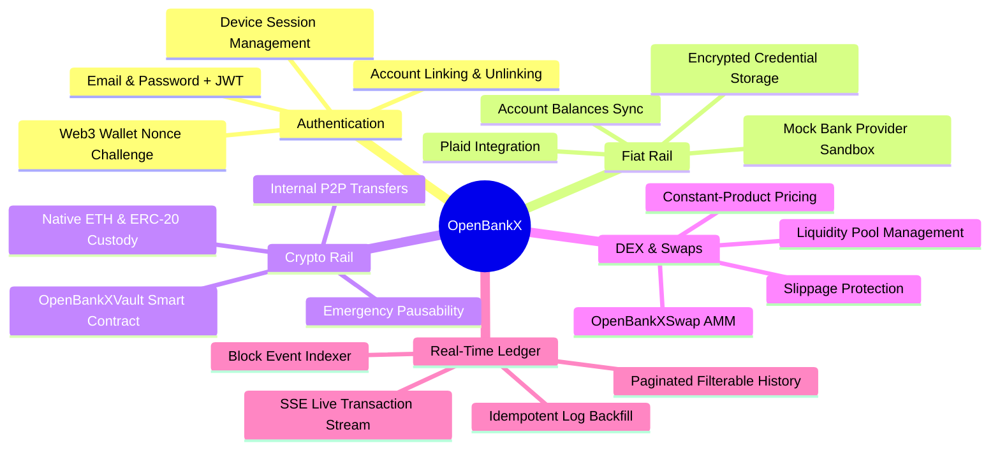

# OpenBankX — Product Requirements Document (PRD)

---

## 1. Document Overview

| Property | Value |
| :--- | :--- |
| **Document Title** | OpenBankX Product Requirements Document |
| **Document Version** | 1.0.0 |
| **Status** | Approved / Active Development |
| **Target Platforms** | Web (Desktop & Mobile Responsive) |
| **Authors** | OpenBankX Core Architecture & Product Team |
| **Last Updated** | 2026-08-17 |

---

## 2. Executive Summary

**OpenBankX** is a next-generation hybrid fintech platform that bridges traditional open banking (fiat rail) and decentralized finance (crypto rail) into a unified, high-performance financial dashboard. 

Historically, users have been forced to navigate two disconnected financial worlds: traditional banking applications (regulated, slow, opaque ledgers) and decentralized Web3 protocols (self-custodial, volatile, complex UX). OpenBankX provides a single pane of glass where users can connect real-world bank accounts via open banking APIs (e.g., Plaid), link self-custodial Ethereum wallets via cryptographic signatures (EIP-191), deposit and manage on-chain vault balances, perform internal zero-gas P2P transfers, execute instant automated market maker (AMM) token swaps, and stream live transaction events in real time.

---

## 3. Problem Statement & Market Opportunity

### 3.1 The Problem
1. **Fragmented Financial Identity**: Users maintain accounts in traditional retail banks and non-custodial Web3 wallets with zero interoperability or aggregate portfolio visibility.
2. **Friction in Fiat-to-DeFi Onramping**: Interacting with DeFi protocols requires complex wallet setups, seed phrase management, and fragmented third-party interfaces.
3. **Slow Settlement & High Gas Costs for Everyday Transfers**: P2P crypto transfers on Ethereum incur variable gas fees and settlement delays, making micro-transactions impractical without an internal ledger.
4. **Poor Real-time Feedback**: Traditional banking apps take 1–3 business days to settle ACH transfers, while Web3 users struggle to understand pending vs. confirmed block states without custom block explorer monitoring.

### 3.2 The Solution
OpenBankX eliminates these barriers by delivering:
- **Dual-Rail Authentication**: Seamless login via traditional Email/Password or Web3 Wallet Signature (Sign-In with Ethereum / EIP-191).
- **Consolidated Fiat & Crypto Ledger**: Instant aggregation of fiat checking, savings, and credit accounts alongside smart contract vault balances.
- **Smart Contract Vault (`OpenBankXVault`)**: On-chain, non-custodial custody of ETH and ERC-20 tokens supporting deposits, withdrawals, and off-chain-indexed internal P2P transfers.
- **Integrated Constant-Product DEX (`OpenBankXSwap`)**: In-app trading between ETH and tokens with automated price discovery ($x \cdot y = k$), customizable slippage controls, and guaranteed liquidity pool reserves.
- **Event-Driven Real-time Indexer**: Live transaction indexing from EVM smart contract logs to MongoDB with Server-Sent Events (SSE) streaming directly to the client UI.

---

## 4. User Personas & Target Audience

| Persona | Description | Key Needs | Pain Points Addressed |
| :--- | :--- | :--- | :--- |
| **Alex — The Crypto Native** | Active DeFi user who holds ETH, stablecoins, and liquidity pool positions. | Fast on-chain swaps, secure wallet-based login, real-time transaction tracking without navigating Etherscan. | Eliminates manual tracking across decentralized apps and allows linking fiat accounts to monitor total net worth. |
| **Sarah — The Modern Investor** | Tech-savvy professional with traditional bank accounts looking to explore digital assets safely. | Intuitive banking UI, clear fiat-to-crypto visibility, reliable security, and low friction. | No steep Web3 learning curve; familiar dashboard with bank linking and automated token exchange quotes. |
| **David — The Cross-Border Peer** | Freelancer receiving multi-currency payments and sending funds to peers. | Instant low-cost peer-to-peer transfers and multi-asset account support. | Internal vault transfers allow instantaneous P2P balance movements without paying per-transfer gas fees. |

---

## 5. Product Scope & Feature Matrix



### 5.1 In-Scope (Phase 1 — Core Platform)
- Dual-rail authentication: Email/Password + MetaMask/EIP-191 signature challenge.
- Plaid & Mock Bank Provider support for linking checking, savings, and credit accounts.
- Automated AES-256-GCM encryption for bank access tokens at rest.
- Smart contract vault deployment on EVM chains (`OpenBankXVault.sol`).
- Automated Market Maker liquidity pool contract (`OpenBankXSwap.sol`).
- Real-time blockchain log synchronizer with historical backfill and live WebSocket subscriptions.
- Server-Sent Events (SSE) endpoint for sub-second client transaction notifications.
- Unified responsive frontend dashboard with live fiat & crypto balance widgets.

### 5.2 Out-of-Scope (Future Iterations)
- Direct Automated Clearing House (ACH) fiat on/off-ramp execution (deposit fiat $\rightarrow$ mint stablecoin).
- Cross-chain bridging across non-EVM chains (e.g., Solana, Bitcoin Lightning).
- Multi-signature treasury governance (Gnosis Safe integration).
- Automated recurring investments (DCA bots).

---

## 6. Detailed Functional Requirements

### 6.1 Authentication & User Management (FR-AUTH)

| Req ID | Requirement | Description | Acceptance Criteria |
| :--- | :--- | :--- | :--- |
| **FR-AUTH-01** | Email Registration | Users can create an account using full name, email, and password. | Password must be $\ge 8$ chars; hashed using bcrypt ($\ge 12$ salt rounds). |
| **FR-AUTH-02** | Email Login | Users can authenticate with registered email and password. | Returns short-lived JWT access token (15m) and sets `httpOnly` secure refresh cookie (7d). |
| **FR-AUTH-03** | Web3 Nonce Challenge | Users can request a cryptographically secure random nonce bound to their Ethereum address. | Nonce stored with 5-minute TTL; formatted with standard EIP-191 sign-in message. |
| **FR-AUTH-04** | Web3 Signature Verification | Backend verifies signed message using `ethers.verifyMessage` to authenticate or auto-provision user. | User is created if non-existent; existing wallet links successfully; JWT issued. |
| **FR-AUTH-05** | Account Linking | An authenticated email user can bind their Web3 wallet to their profile. | Enforces 1-to-1 wallet uniqueness; prevents account collisions. |
| **FR-AUTH-06** | Session Rotation & Logout | Token refresh endpoint validates refresh token against whitelist array with reuse detection. | Stolen or reused refresh tokens immediately revoke all active sessions. |

### 6.2 Fiat Banking Integration (FR-BANK)

| Req ID | Requirement | Description | Acceptance Criteria |
| :--- | :--- | :--- | :--- |
| **FR-BANK-01** | Link Token Creation | Backend generates a Plaid / Mock provider link token tied to user ID. | Token returned with supported product list (`auth`, `transactions`). |
| **FR-BANK-02** | Public Token Exchange | Frontend exchanges Plaid public token for permanent access token. | Access token encrypted using AES-256-GCM before database write; never exposed to client. |
| **FR-BANK-03** | Account Discovery | Automatically extracts institution name, account name, type, mask, and balances. | Accounts upserted under `(userId, providerAccountId)` compound key. |
| **FR-BANK-04** | On-Demand Balance Refresh | Users can trigger a fresh pull of account balances from provider. | Groups account IDs per access token to minimize API rate limit consumption. |
| **FR-BANK-05** | Mock Provider Sandbox | Provides full offline sandbox mode with simulated institutions (Chase, BoA, Wells Fargo). | Enables deterministic development and UI testing without Plaid API credentials. |
| **FR-BANK-06** | Account Unlinking | Users can remove a linked bank account and revoke upstream access tokens. | Database record soft/hard deleted; provider token revocation executed gracefully. |

### 6.3 Smart Contract Vault & Crypto Custody (FR-VAULT)

| Req ID | Requirement | Description | Acceptance Criteria |
| :--- | :--- | :--- | :--- |
| **FR-VAULT-01** | ETH Deposit | Users deposit native ETH into `OpenBankXVault` with off-chain `refId`. | Contract updates `balances[address(0)][msg.sender]` and emits `Deposited`. |
| **FR-VAULT-02** | ERC-20 Token Deposit | Users deposit allowlisted ERC-20 tokens via `depositToken`. | Uses `SafeERC20.safeTransferFrom`; validates `onlySupported(token)` modifier. |
| **FR-VAULT-03** | ETH / Token Withdrawal | Users withdraw deposited funds back to their connected Web3 wallet. | Checks-effects-interactions pattern followed; non-reentrant; emits `Withdrawn`. |
| **FR-VAULT-04** | Internal P2P Transfers | Instant off-chain/on-chain transfer between two vault user balances. | Transfers balance directly in storage without moving underlying tokens; zero external transfer gas. |
| **FR-VAULT-05** | Emergency Circuit Breaker | Contract owner can pause all vault deposits, withdrawals, and transfers. | View functions remain accessible; all state mutations revert with `EnforcedPause`. |

### 6.4 Decentralized AMM Swaps (FR-SWAP)

| Req ID | Requirement | Description | Acceptance Criteria |
| :--- | :--- | :--- | :--- |
| **FR-SWAP-01** | Constant Product AMM | Automated liquidity pools operating on the $x \cdot y = k$ invariant. | Supports native ETH (`address(0)`) and ERC-20 pairs with 0.3% fixed fee. |
| **FR-SWAP-02** | Real-time Swap Quotes | View function `getAmountOut` computes output amount given exact input. | Output matches $(A_{in} \cdot 997 \cdot R_{out}) / (R_{in} \cdot 1000 + A_{in} \cdot 997)$. |
| **FR-SWAP-03** | Slippage Guard | Swaps enforce a caller-specified `minAmountOut` parameter. | Reverts with `SlippageExceeded` if price impacts exceed user tolerance. |
| **FR-SWAP-04** | Liquidity Provision | Liquidity providers can deposit pair assets and receive LP shares. | First deposit locks `MINIMUM_LIQUIDITY` (1000 wei) permanently to prevent share-inflation attacks. |
| **FR-SWAP-05** | Canonical Pool Identification | Pool IDs are canonically computed via sorted token addresses (`t0 < t1`). | Prevents duplicate asymmetric pools for the same pair. |

### 6.5 Real-Time Event Indexing & Transactions (FR-SYNC)

| Req ID | Requirement | Description | Acceptance Criteria |
| :--- | :--- | :--- | :--- |
| **FR-SYNC-01** | Historical Event Backfill | On backend startup, synchronizer scans blocks from `lastProcessedBlock` to head. | Queries `Deposited`, `Withdrawn`, `Transferred`, `Swapped` logs. |
| **FR-SYNC-02** | Live Event Subscription | Node listens to live smart contract event filters over WebSocket / JSON-RPC. | Emits parsed events immediately to internal `EventEmitter`. |
| **FR-SYNC-03** | Idempotent Log Ingestion | Transaction store enforces unique index on `(txHash, logIndex)`. | Prevents duplicate records during network reorgs or overlapping sync runs. |
| **FR-SYNC-04** | SSE Real-time Feed | `/api/blockchain/transactions/stream` delivers live updates to clients. | Filtered by connected wallet address; includes keep-alive heartbeat ping every 25s. |
| **FR-SYNC-05** | Paginated History API | REST endpoint to fetch historical activity with pagination and event filtering. | Supports filtering by `deposit`, `withdraw`, `transfer`, `swap`. |

---

## 7. Non-Functional Requirements (NFRs)

### 7.1 Security & Cryptography
- **NFR-SEC-01**: Sensitive credentials (bank access tokens) must be encrypted at rest using AES-256-GCM with distinct initialization vectors (IV) and authentication tags.
- **NFR-SEC-02**: Passwords must be hashed using bcrypt with a work factor $\ge 12$. Plaintext passwords must never be logged or returned in query results (`select: false`).
- **NFR-SEC-03**: Smart contracts must be protected against reentrancy attacks using OpenZeppelin `ReentrancyGuard` and strict Checks-Effects-Interactions (CEI).
- **NFR-SEC-04**: Web3 authentication messages must conform to EIP-191 standard and incorporate single-use nonces with expiration to prevent replay attacks.
- **NFR-SEC-05**: All REST endpoints must enforce rate limiting (max 100 requests per 15-minute window per IP).

### 7.2 Performance & Scalability
- **NFR-PERF-01**: Read API endpoints (balances, profile, config) must respond within $< 100\text{ms}$ at p95.
- **NFR-PERF-02**: Real-time SSE updates must be delivered to frontend clients within $< 1.5\text{s}$ of block inclusion.
- **NFR-PERF-03**: Swap quote calculations must execute in $< 50\text{ms}$ via view functions.
- **NFR-PERF-04**: Database queries on transaction history must utilize compound indexes to maintain $< 30\text{ms}$ execution time for 1M+ records.

### 7.3 Availability & Reliability
- **NFR-AVAIL-01**: Backend API services must achieve 99.9% uptime.
- **NFR-AVAIL-02**: Blockchain indexer must gracefully reconnect with exponential backoff if RPC node drops connection.
- **NFR-AVAIL-03**: Frontend must handle intermittent network loss and re-establish SSE connections seamlessly.

### 7.4 Usability & Accessibility
- **NFR-UX-01**: Fully responsive layout optimized for Desktop (1440px+), Tablet (768px+), and Mobile (375px+).
- **NFR-UX-02**: Visual system must support WCAG 2.1 AA contrast compliance across both Light and Dark themes.
- **NFR-UX-03**: Numbers, currency, and crypto units must format with appropriate decimals and animated transitions.

---

## 8. Data & Compliance Specifications

```
+-----------------------------------------------------------------------------+
| DATA CLASSIFICATION TIER                                                    |
+------------------------------------+----------------------------------------+
| Tier 1: Highly Restricted          | Encrypted Bank Access Tokens, Nonces   |
|                                    | (AES-256-GCM / In-Memory TTL Store)    |
+------------------------------------+----------------------------------------+
| Tier 2: Confidential PII           | User Name, Email, Password Hash (BCrypt)|
+------------------------------------+----------------------------------------+
| Tier 3: Public Ledger / On-Chain   | Wallet Addresses, Tx Hashes, Log Indexes|
|                                    | Event Amounts, Block Numbers, ABIs     |
+------------------------------------+----------------------------------------+
```

---

## 9. Success Metrics & Key Performance Indicators (KPIs)

1. **User Adoption**: Number of active users linking both a Fiat Bank Account and a Web3 Wallet.
2. **Transaction Velocity**: Total Volume ($USD equivalent) locked in `OpenBankXVault` and traded via `OpenBankXSwap`.
3. **Internal Transfer Volume**: Percentage of P2P transfers settled internally vs. on-chain external transfers.
4. **Sync Latency**: Time elapsed from block confirmation to SSE client UI render ($< 2\text{s}$).
5. **System Reliability**: Zero security vulnerabilities, zero reentrancy exploits, 99.9% API uptime.

---

## 10. Future Roadmap & Milestones

- **Milestone 1 (Current)**: Core Dual-Auth, Plaid + Mock Bank integration, Vault & Swap Smart Contracts, Real-Time Indexer, Unified Dashboard.
- **Milestone 2**: Direct fiat ACH on-ramp/off-ramp with stablecoin minting/burning (USDC integration).
- **Milestone 3**: Multi-chain deployment (Arbitrum, Optimism, Polygon) and Layer 2 gas abstraction via Account Abstraction (ERC-4337).
- **Milestone 4**: Automated recurring savings rules, yield aggregation, and advanced institutional analytics.
